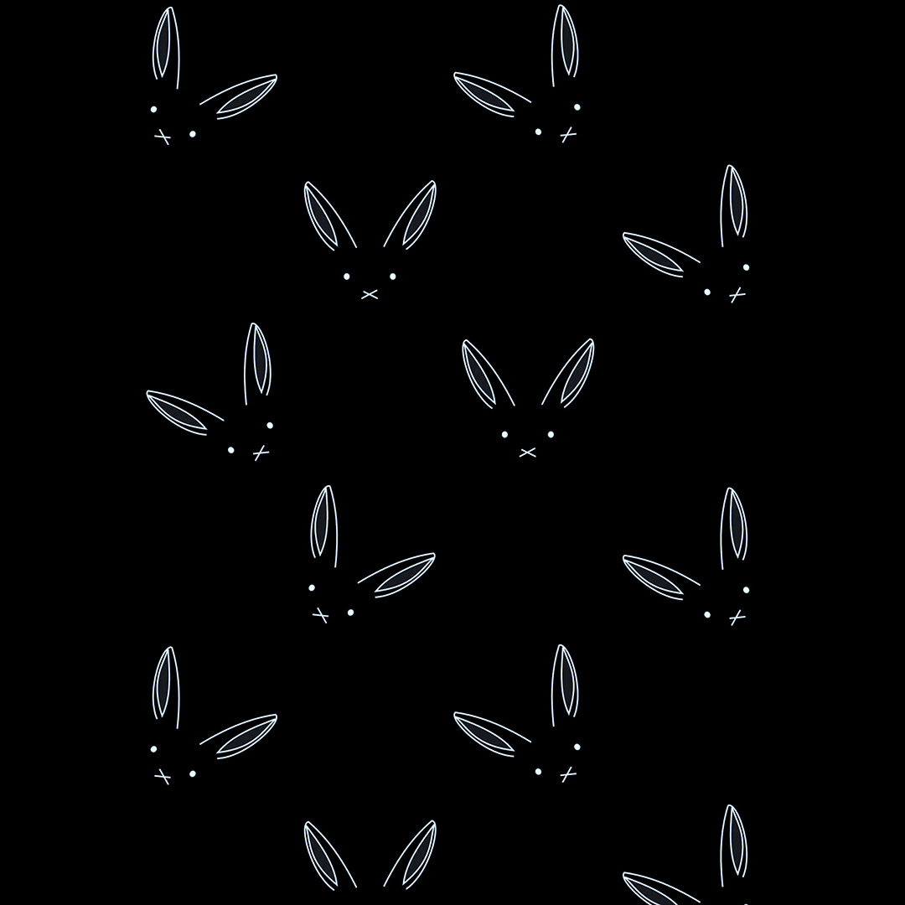

  

   

  
  ### Main skills:
  
---

&nbsp;
&nbsp;
&nbsp;
&nbsp;
&nbsp;
&nbsp;

 

### Tools: 

---

&nbsp;
&nbsp;
&nbsp;
&nbsp;
&nbsp;
&nbsp;
&nbsp;

 

### Other Knowledge: 

---

&nbsp;
&nbsp;
&nbsp;
&nbsp;
&nbsp;
&nbsp;

